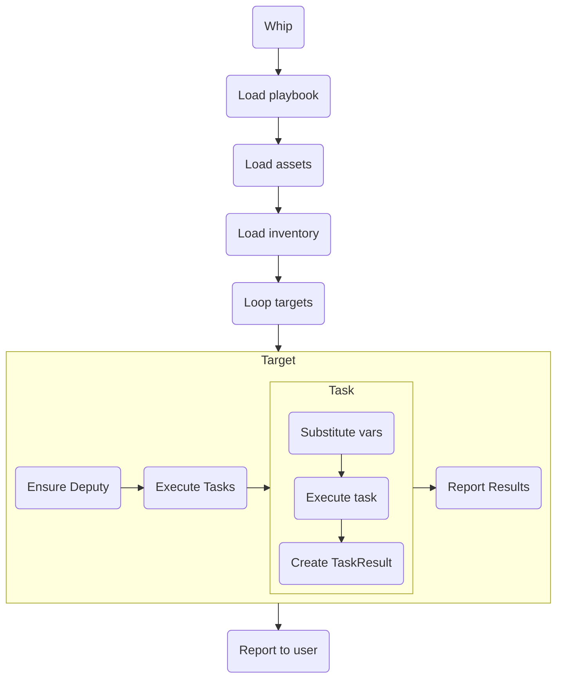

# rough architecture

```mermaid
%%{init: {"flowchart": {"defaultRenderer": "elk"}} }%%

flowchart TB;
    p1(Load playbook)
    p2(Load assets)
    p3(Load inventory)

    W(Whip)-->p1-->p2-->p3-->L(Loop targets)

    L-->Target

    subgraph Target
        direction LR
        t1(Ensure Deputy)-->t2(Execute Tasks)
        
        Task-->t3(Report Results)

        t2-->Task
        subgraph Task
            direction TB
            k1(Substitute vars)-->k2(Execute task)-->k3(Create TaskResult)
        end

    end

    Target-->report(Report to user)

```