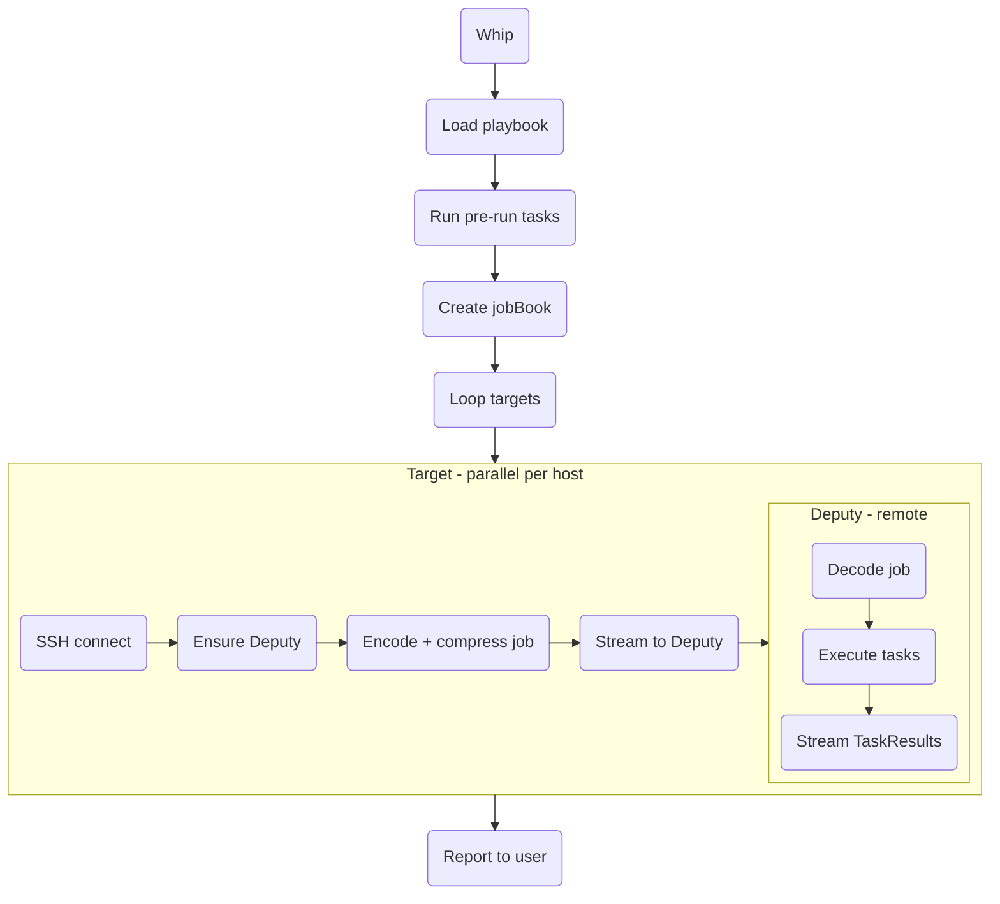

# Architecture

# Possible improvements

## Error Handling & Resilience

**Graceful target failure**: Currently `log.Fatal` in `runPlaybookAtHost` kills the entire process when one target fails. With multiple targets running in parallel, this aborts all other targets mid-execution. Consider sending failures through the results channel and allowing other targets to complete.

**Resource cleanup**: SSH sessions in `internal/ssh/ssh.go` are not always closed on early returns (e.g., when `StdoutPipe()` or `Start()` fails). Add `defer s.Close()` immediately after session creation.

## Type Safety

**Status codes**: The `Status` field uses `int` with constants (`Success`, `Failed`, `Skipped`). A typed `type Status int` would prevent accidental misuse and enable exhaustive switch checking.

**TaskResult initialization**: Multiple patterns exist (named returns, struct literals, `failure()` helper). Standardizing on one approach would improve consistency.

## Testability

**Global state in runners**: The `fs`, `fsutil`, `runners`, and `facts` variables are package-level globals modified by tests. Consider dependency injection or a `RunnerContext` struct to improve isolation.

## Performance Considerations

**Asset bundling**: Assets are currently embedded in the Job and sent to every target. For large file trees or many targets, consider:
- Deduplication across targets
- On-demand asset streaming
- Caching unchanged assets on targets

**Connection pooling**: Each target gets a fresh SSH connection. For playbooks that run multiple times, connection reuse could reduce overhead.

## Protocol

**Bidirectional communication**: Currently the deputy streams results back but cannot request additional data. A request/response protocol would enable:
- On-demand asset fetching
- Dynamic fact gathering
- Interactive prompts
